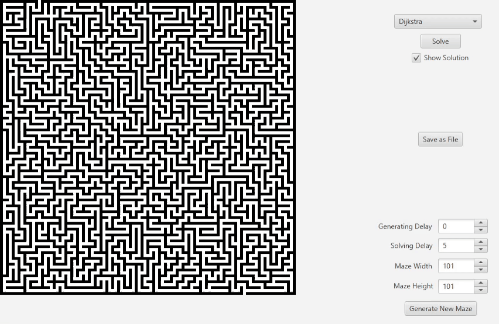

# Maze Generator and Solver
Written in Java with javafx GUI.  
Generate mazes and solve them using various path finding algorithms.

# Maze
Mazes are made of black and white squares where black represents walls and white the paths.   
Mazes are surrounded by walls except one square on the top-left third and one on the bottom-right third. These represent the entry and exit of the maze.  
There is exactly one path between the entry and exit of the maze. 

# Preview
